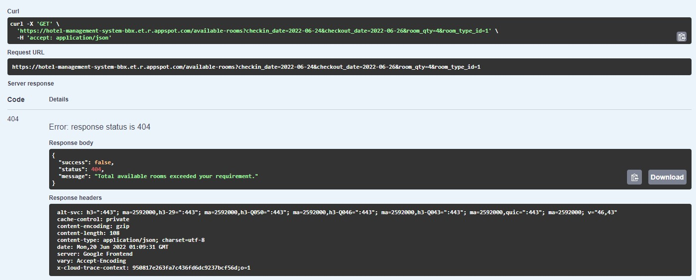

## Table of Contents
* [General Info](#general-information)
* [Technologies Used](#technologies-used)
* [Tasks](#tasks)
* [API Documentations](#api-documentations)

## General Information
- Hotel Management System.
- Search for available rooms and promotion rooms

## Technologies Used
- Golang
- Gin Framework
- MySql
- GCP

## Tasks
List of tasks:
- ERD for hotel management systems

I categorized the database to 3 section.
1. the first section on the left is for managing customer reservation that contains: reservation for managing customer reservation,
stay for managing the guess who stays, and stayroom for managing when guess stay and where the room that has booked.
2. the second section on the middle is for managing hotel and rooms that contains: hotel for managing the list of hotels,
room for managing rooms for each hotels, room type for managing list of type of the room, price for managing
the list of price for each room type at each hotel.
3. the third section on the right is for managing reports that contains: order for managing orders report with the total price of
the reservation order, and order status for managing status of the order.

- Search for available rooms

success req and response example 

unavailable req and response example 

- Search for promotion rooms

success promo request example

success promo response example

uneligible promo request example

uneligible promo response example

## API Documentations
- Swagger
https://hotel-management-system-bbx.et.r.appspot.com/swagger/index.html
- Postman Collection
https://www.getpostman.com/collections/49d04f2e5e89689fa9d9
